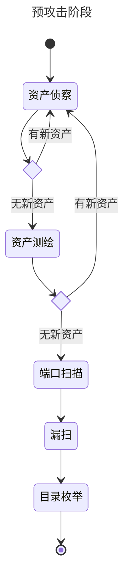
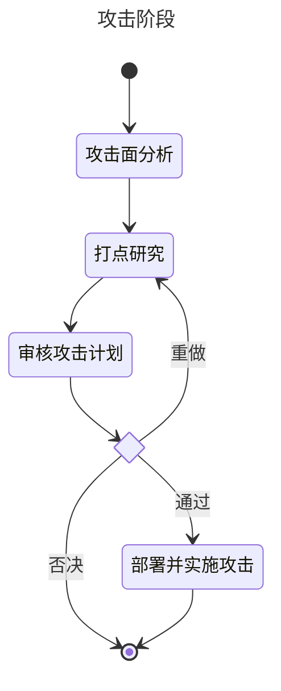

# Blade Razor 刃影

由人工智能驱动的渗透测试解决方案

An AI-Driven Pentesting Solution.

资产侦察工具借鉴了 [OneForAll](https://github.com/shmilylty/OneForAll)

## 使用

    # 创建一个 python 3.12 虚拟环境, 你也可以用 virtualenv
    conda create -n bladerazor python=3.12.3
    conda activate bladerazor
    
    # 更新
    conda update --all
    pip install pip-review
    pip-review --local --auto

    # 安装依赖
    pip install -r requirements.txt

## 数据库

    docker run --name bladerazor-pg \
        -e POSTGRES_USER=bladerazor \
        -e POSTGRES_PASSWORD=123456 \
        -e POSTGRES_DB=bladerazor \
        -p 15432:5432 \
        -d pgvector/pgvector:pg16

## LLM

| LLM           | 效果 | 推荐  |
|---------------|----|-----|
| gpt-3.5-turbo | 可用 | ⭐⭐⭐ | 

## 工作机制

