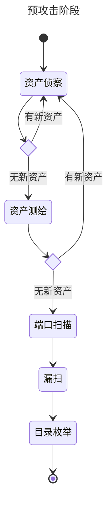
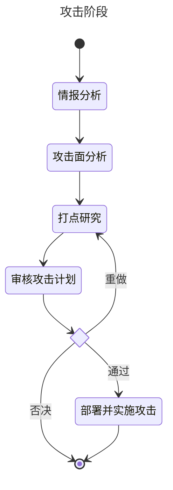

# Blade Razor 刃影

由人工智能驱动的渗透测试解决方案

An AI-Driven Pentesting Solution.

资产侦察工具借鉴了 [OneForAll](https://github.com/shmilylty/OneForAll)

## 说明

本项目初衷只用于验证AI在渗透测试中的应用。

渗透测试本质上是基于网络安全人员的经验和知识，利用各种工具和技术对目标系统进行安全评估。

而LLM以及langchain这类ai agent的出现，是我们可以利用大模型的能力，来具体实施一些事情。

经过验证，LLM在渗透测试中的应用是可行的，以下四点对最终效果有决定性影响：

1. 大模型的选择
   只要参数大即可，无需过于关注模型是否针对特定领域进行过微调，特定领域的知识，用rag可以解决。
2. RAG
   相当于脱离LLM的外挂知识库，只要私有知识库足够完善，其“经验”就会足够丰富。
3. 提示词
   通过提示词模拟出各种角色，如黑客、安全研究员、安全工程师等，这样可以让LLM更好的理解我们的需求。
4. 外部工具
   武器库越丰富肯定越好

## TODO

待办事项过多...

## 使用

    # 创建一个 python 3.12 虚拟环境, 你也可以用 virtualenv
    conda create -n bladerazor python=3.12.3
    conda activate bladerazor
    
    # 更新
    conda update --all
    pip install pip-review
    pip-review --local --auto

    # 安装依赖
    pip install -r requirements.txt

## 环境变量

LLM模型相关的配置遵循langchain的配置方式，具体参考[langchain](https://python.langchain.com/v0.1/docs/integrations/llms/)

```
OPENAI_API_BASE=https://xxx # 如果使用ollama等可以修改这里
OPENAI_API_KEY=xxxx
OPENAI_MODEL_NAME=gpt-4o

# crewai遥测，最好关闭
OTEL_SDK_DISABLED=true


FOFA_API_KEY=xxxxxxxx
FOFA_EMAIL=fofauser@emailaddress
FOFA_VERSION=ent

GOBUSTER_PATH=/your/gobuster/path/folder
GOBUSTER_WORDLIST_PATH=/your/wordlists/small.txt

NUCLEI_PATH=/your/nuclei/path/folder
NUCLEI_TEMPLATES_PATH=/your/nuclei/path/folder/templates

SECURITYTRAILS_API_KEY=xxxxxxxx
```

## 导入知识库

工具为`cmd/knowledge.py`，默认使用openai的嵌入式模型，请参阅源码。

## 执行

目前代码在`bladerazor.py`，请参阅源码。

## 数据库

    docker run --name bladerazor-pg \
        -e POSTGRES_USER=bladerazor \
        -e POSTGRES_PASSWORD=123456 \
        -e POSTGRES_DB=bladerazor \
        -p 15432:5432 \
        -d pgvector/pgvector:pg16

## LLM

本地模型受制于硬件，ollma或者lmstudio都没有完美的跑起来

目前只测试了以下模型:

| LLM           | 效果 | 推荐   |
|---------------|----|------|
| gpt-3.5-turbo | 可用 | ⭐⭐⭐  | 
| gpt-4o        | 可用 | ⭐⭐⭐⭐ | 

## 工作机制




